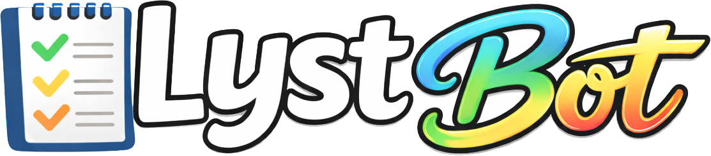
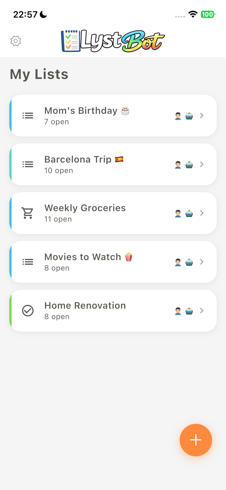
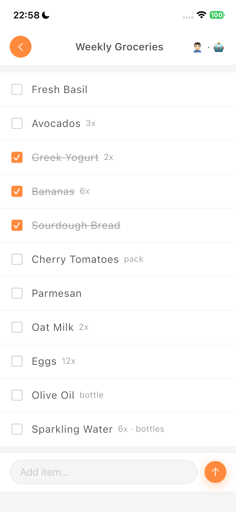
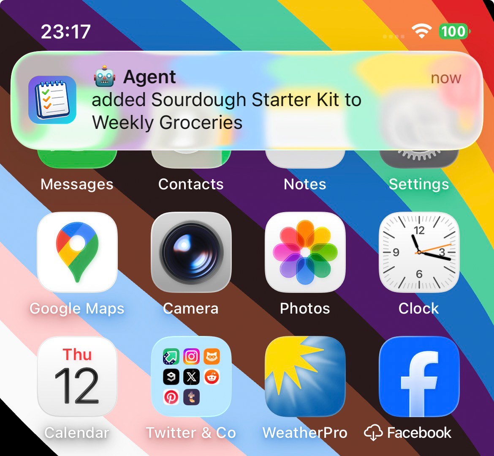

<p align="center">
  
</p>

<h3 align="center">Smart lists that your AI can actually use.</h3>

<p align="center">
  <a href="LICENSE"></a>
  <a href="https://www.npmjs.com/package/lystbot"></a>
  <a href="https://lystbot.com/api/v1/health"></a>
</p>

<p align="center">
  <strong>LystBot</strong> is a list app built for the AI era. Not just another todo app with an AI button slapped on - it's designed from day one so that <em>any</em> AI agent can manage your lists for you.
</p>

---

## ⚡ Quick Start

```bash
npx lystbot login YOUR_API_KEY
lystbot add "Groceries" "Oat milk, Bananas, Coffee"
```

Get your API key from the LystBot app (Settings → AI Agents). That's it. Your AI agent can now manage your lists, and changes sync to your phone instantly.

---

## 🧠 Built for AI Agents

Most list apps treat AI as a feature. LystBot treats AI as a **first-class user**.

Every list, every item, every action is available through a clean REST API. No scraping, no workarounds, no browser automation. Just `Authorization: Bearer <your-key>` and you're in.

**Why this matters:**

- 🤖 **Your AI assistant can manage your groceries** - "Add eggs to my shopping list" actually works, from any AI
- 🔑 **Dual auth system** - Device UUIDs for the app, Bearer tokens for agents. Clean separation.
- 📡 **Real-time sync** - Changes from your AI show up on your phone instantly
- 💻 **CLI + REST API** - Automate anything, from any language

> *"The best list app is the one you never have to open."*

---

## ✨ Features

🗒️ **Smart Lists** - Create, organize, and share lists with anyone

🤝 **Real-time Sharing** - Invite others via share codes, collaborate live

📱 **Cross-Platform** - iOS and Android (Flutter), with CLI and API access

⭐ **Favorites** - Quick-access items you use all the time (reusable templates)

🔔 **Push Notifications** - Get notified when shared lists change

🌐 **Open API** - Full REST API, documented and ready for automation

<p align="center">
  
  &nbsp;&nbsp;
  
  &nbsp;&nbsp;
  
</p>

---

## 📚 Documentation

- 📡 **[API Reference](./docs/api/)** - Full endpoint docs with curl examples
- 💻 **[CLI Reference](./docs/cli/)** - Command-line interface docs

---

## 🏗️ Architecture

```
┌─────────────┐     ┌─────────────┐     ┌─────────────┐
│  Mobile App  │     │     CLI     │     │  AI Agents  │
│  (Flutter)   │     │   (Node)    │     │  (REST API) │
└──────┬───────┘     └──────┬──────┘     └──────┬──────┘
       │                    │                    │
       │  X-Device-UUID     │  Bearer Token      │  Bearer Token
       │                    │                    │
       └────────────────────┼────────────────────┘
                            │
                    ┌───────▼───────┐
                    │   LystBot API  │
                    │   (REST/JSON)  │
                    └───────────────┘
```

---

## 🚀 Getting Started

**As a user:** Download LystBot on [iOS](https://apps.apple.com/app/lystbot) or [Android](https://play.google.com/store/apps/details?id=io.touraround.lystbot) (coming soon)

**As a developer:** Check the [API docs](./docs/api/) and grab your Bearer token

**As an AI agent:** Hit the REST API directly with your Bearer token

---

## 🤝 Contributing

We'd love your help! Whether it's:

- 🐛 Bug reports and feature requests via [Issues](https://github.com/TourAround/LystBot/issues)
- 🔧 CLI improvements and new commands
- 📖 Documentation fixes

Fork it, branch it, PR it. Keep it clean, keep it tested.

---

## 📄 License

MIT - see [LICENSE](./LICENSE) for details.

Built with ❤️ by [TourAround UG](https://lystbot.com)
