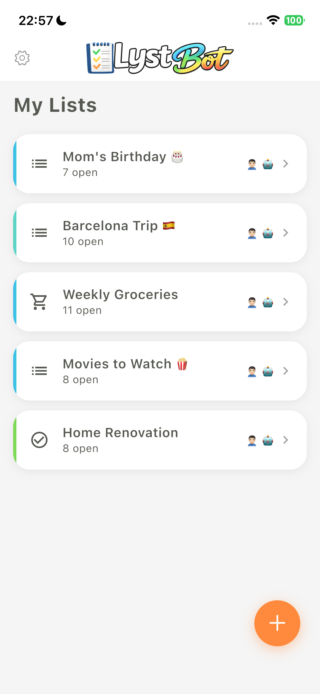
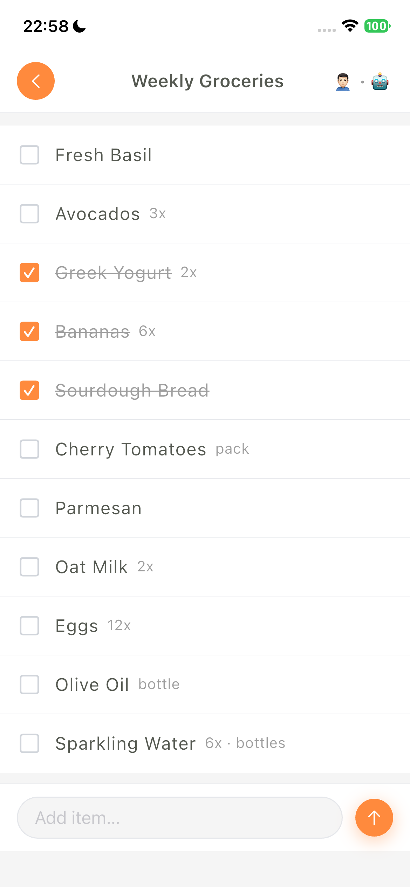
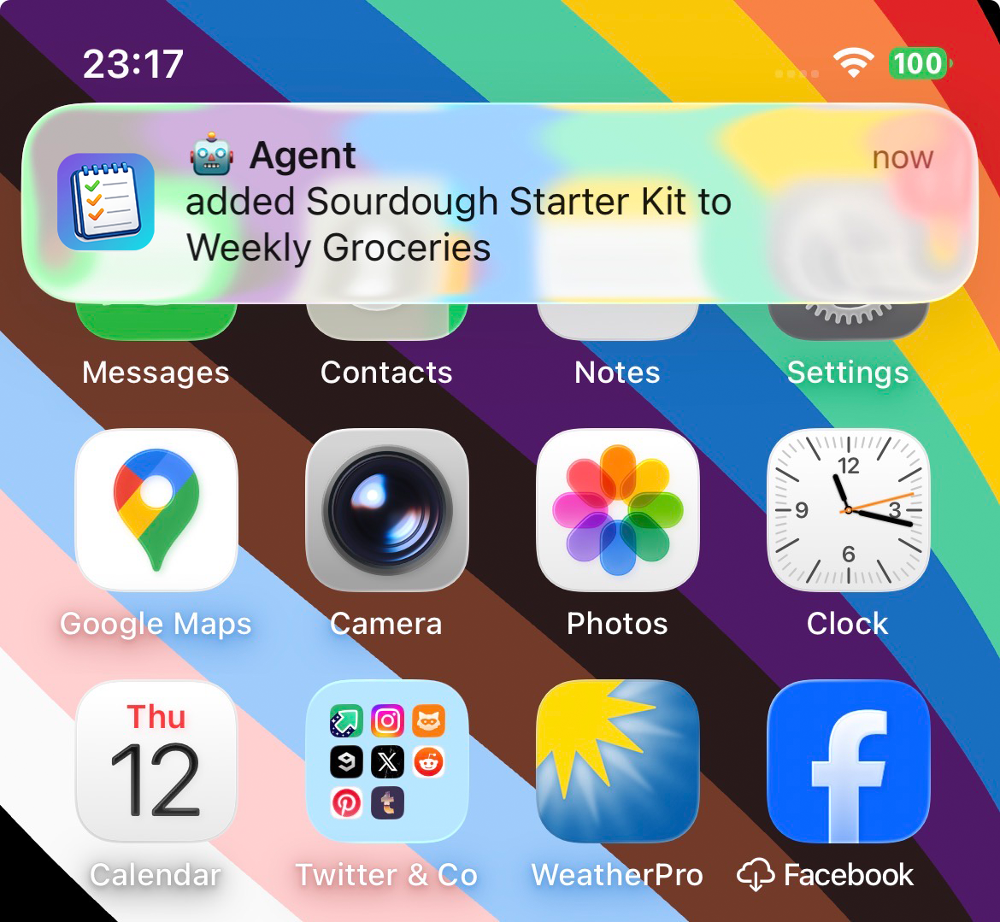

<p align="center">
  
</p>

<h3 align="center">Smart lists and reminders that your AI can actually use.</h3>

<p align="center">
  <a href="LICENSE"></a>
  <a href="https://www.npmjs.com/package/lystbot"></a>
  <a href="https://lystbot.com/api/v1/health"></a>
</p>

<p align="center">
  <strong>LystBot is not another AI list app.</strong> There's no built-in AI. No chatbot. No "AI-powered suggestions."<br />
  Instead, LystBot gives <em>your</em> AI - whether it's a personal agent on OpenClaw, a Custom GPT, or Claude - a direct line to your lists and reminders.<br />
  <strong>Your AI controls the lists and reminders. The app is the window to the real world.</strong>
</p>

---

## 🚀 Getting Started

### 1. Get the App

<p align="center">
  <a href="https://apps.apple.com/app/lystbot/id6742044832"></a>
  &nbsp;&nbsp;
  <a href="https://play.google.com/store/apps/details?id=io.touraround.lystbot"></a>
</p>

Open the app, create your first list, and grab your API key from **Settings → AI Agents**.

### 2. Connect Your AI Agent

Head over to the agent setup page for step-by-step instructions:

👉 **[lystbot.com/agents](https://lystbot.com/agents)**

Three ways to connect, depending on your setup:

| Method | Best for | Setup time |
|--------|----------|------------|
| **CLI** | OpenClaw, personal agents, scripts, automation | 1 min |
| **MCP Server** | Claude Desktop, Cursor, Windsurf, Cline | 2 min |
| **REST API** | ChatGPT Actions, custom agents, Home Assistant | 5 min |

### 3. That's it

```bash
npx lystbot login YOUR_API_KEY
lystbot add "Groceries" "Oat milk, Bananas, Coffee"
```

Your agent adds items. Your phone updates instantly. Done.

---

## 🧠 How It Works

Most "AI list apps" shove a chatbot inside the app. LystBot does the opposite: **your AI lives where it already lives**, and LystBot is the app it controls.

```
You → talk to your AI → AI calls LystBot API → your phone updates instantly
```

No new AI to learn. No prompts inside the app. Just connect your existing AI and it manages your groceries, packing lists, todos, reminders - anything.

- 🤖 **"Add eggs to my shopping list" actually works** - from any AI you already use
- 📱 **Your phone is the display** - your AI writes, you see it instantly
- 🔑 **Clean separation** - the app is for humans, the API is for agents
- 🔄 **Real-time sync** - your AI adds milk, your partner sees it immediately

---

## ✨ Features

🗒️ **Smart Lists** - Create, organize, and share lists with anyone

🤝 **Real-time Sharing** - Invite others via share codes, collaborate live

📱 **Cross-Platform** - iOS and Android, with CLI and API access

⭐ **Favorites** - Quick-access items you use all the time

🗂️ **Categories** - Structure lists into sections, move items between categories, keep uncategorized items in Other

📎 **Attachments** - Attach images and links to items, from the app, the CLI, or an MCP agent

⏰ **Reminders** - Let your AI create, update, disable, and delete one-time or recurring reminders

🔔 **Push Notifications** - Know when your AI or your family changes a list

🌐 **Open API** - Full REST API so any AI agent can read, write, and manage lists, categories, and reminders

<p align="center">
  
  &nbsp;&nbsp;
  
  &nbsp;&nbsp;
  
</p>

---

## 🤖 Agent Integrations

LystBot works with any AI that can make HTTP requests. Here's how to connect yours:

### Personal Agents & Autonomous Frameworks

| Agent | Provider | Integration |
|-------|----------|-------------|
| **OpenClaw** | OpenClaw | **CLI** (`npx lystbot`) |
| Devin | Cognition AI | CLI or REST API |
| Aider | Open Source | CLI |
| OpenCode | Open Source | CLI or MCP Server |
| AutoGPT | Open Source | REST API |
| CrewAI | Open Source | REST API |
| Manus AI | Manus | REST API |

### Coding Agents & IDEs

| Agent | Provider | Integration |
|-------|----------|-------------|
| Claude Desktop | Anthropic | MCP Server ([setup below](#claude-desktop)) |
| Claude Code | Anthropic | MCP Server ([setup below](#claude-code)) |
| Cursor | Anysphere | MCP Server |
| Windsurf | Codeium | MCP Server |
| GitHub Copilot | Microsoft | MCP Server or Copilot Extension |
| Cline | Open Source | MCP Server |

### Voice Assistants & Chat AI

| Agent | Provider | Integration |
|-------|----------|-------------|
| ChatGPT | OpenAI | Custom GPT with OpenAPI Actions |
| Google Gemini | Google | Gemini Extensions via REST API |
| Microsoft Copilot | Microsoft | Copilot Plugin with OpenAPI |
| Grok | xAI | REST API |
| Siri / Apple Intelligence | Apple | Apple Shortcuts with REST API |
| Amazon Alexa | Amazon | Custom Alexa Skill with REST API |
| Google Home | Google | Google Actions with REST API |

> Don't see your agent? If it can call an API, it can use LystBot. Check the [API docs](./docs/api/).

---

## 💻 CLI

The LystBot CLI lets you manage lists from the terminal. Built for AI agents like **OpenClaw** that work best with command-line tools, and for anyone who likes to script things.

### Install & Login

```bash
npx lystbot login <YOUR_API_KEY>
```

### Commands

```bash
# Lists
lystbot lists                              # Show all lists
lystbot show "Groceries"                   # Show a list with items
lystbot create "Packing List" --emoji "🧳" # Create a new list
lystbot delete "Old List" --force          # Delete a list

# Items
lystbot add "Groceries" "Milk, Eggs, Bread"  # Add items (comma-separated)
lystbot add "Groceries" "250g Mehl; 3x Milch; 3 Bananen" # Parse unit and count prefixes
lystbot add "Groceries" "Mehl" --quantity 2 --unit "500g" # Explicit fields
lystbot check "Groceries" "Milk"             # Check off an item
lystbot uncheck "Groceries" "Milk"           # Uncheck an item
lystbot remove "Groceries" "Milk"            # Remove an item

# Attachments
lystbot attach-image "Groceries" "Milk" ./photo.jpg     # Attach a local image
lystbot attach-url "Groceries" "Milk" "https://example.com" "Recipe"  # Attach a link
lystbot attachments "Groceries" "Milk"                  # Show attachments
lystbot detach <attachment-id>                          # Delete an attachment

# Categories
lystbot categories "Groceries"                 # List categories (incl. Other)
lystbot category add "Groceries" "Fruits"      # Create a category
lystbot add "Groceries" "Bananas" --category "Fruits"   # Add into a category
lystbot move "Groceries" "Bananas" --category other      # Move to Other/uncategorized

# Reminders
lystbot reminders                                      # Show all reminders
lystbot reminder <id>                                  # Show one reminder
lystbot remind "Take vitamins" --at "2026-05-08 09:00" --timezone "Europe/Berlin"
lystbot reminder-update <id> --title "Take supplements"
lystbot reminder-update <id> --at "2026-05-09 09:00" --enabled
lystbot reminder-update <id> --disabled
lystbot reminder-delete <id> --yes

# Sharing
lystbot share "Groceries"                  # Generate a share code
lystbot join ABC123                        # Join a shared list

# Agent identity
lystbot profile --name "TARS" --emoji "🤖" # Set your bot's display name
```

> Full reference: [CLI docs](./docs/cli/)

---

## 🔌 MCP Server

LystBot ships with a built-in [MCP](https://modelcontextprotocol.io) server. Works with **Claude Desktop**, **Claude Code**, **Cursor**, **Windsurf**, **Cline**, and any MCP-compatible client.

**First, authenticate** (all setups need this):

```bash
npx lystbot login <YOUR_API_KEY>
```

### Claude Desktop

Add this to your config file:

**macOS:** `~/Library/Application Support/Claude/claude_desktop_config.json`
**Windows:** `%APPDATA%\Claude\claude_desktop_config.json`

```json
{
  "mcpServers": {
    "lystbot": {
      "command": "npx",
      "args": ["lystbot", "mcp"]
    }
  }
}
```

Restart Claude Desktop. Done.

### Claude Code

One command:

```bash
claude mcp add lystbot -- npx lystbot mcp
```

That's it. Claude Code can now manage your lists.

### Cursor / Windsurf / Cline

Add the same config to your editor's MCP settings:

```json
{
  "mcpServers": {
    "lystbot": {
      "command": "npx",
      "args": ["lystbot", "mcp"]
    }
  }
}
```

### Available Tools

| Tool | Description |
|------|-------------|
| `list_lists` | Get all your lists |
| `get_list` | Get a specific list with items |
| `create_list` | Create a new list |
| `delete_list` | Delete a list |
| `add_items` | Add natural strings or structured `{text, quantity?, unit?}` items |
| `check_item` | Check off an item |
| `uncheck_item` | Uncheck an item |
| `remove_item` | Remove an item from a list |
| `clear_checked` | Remove all checked (completed) items from a list |
| `share_list` | Generate a share code for a list |
| `join_list` | Join a shared list via code |
| `list_categories` | List categories for a list |
| `create_category` | Create a category |
| `rename_category` | Rename a category |
| `delete_category` | Delete a category |
| `reorder_categories` | Reorder categories |
| `move_item` | Move an item to a category (or Other) |
| `add_item_image` | Attach an image to an item (local path or base64) |
| `add_item_url` | Attach a link to an item |
| `list_item_attachments` | List all attachments of an item |
| `delete_item_attachment` | Delete an attachment by ID |
| `list_reminders` | Get all reminders |
| `get_reminder` | Get one reminder |
| `create_reminder` | Create a reminder |
| `update_reminder` | Update a reminder |
| `delete_reminder` | Delete a reminder |

`add_items` understands `250g Mehl`, `3x Milch`, plain counts such as `3 Bananen` / `3 bananas`, and container forms such as `2 Flaschen Wein`. Agents can instead send `[{"text":"Mehl","quantity":2,"unit":"500g"}]`; weight belongs in `unit`, not quantity `250`.

---

## 🏗️ Architecture

```
┌──────────────┐  ┌──────────────┐  ┌──────────────┐  ┌──────────────┐
│  Your Phone  │  │   Your AI    │  │  MCP Client  │  │     CLI      │
│  (LystBot    │  │  (OpenClaw,  │  │  (Claude,    │  │  (npx        │
│   App)       │  │   ChatGPT)   │  │   Cursor)    │  │   lystbot)   │
└──────┬───────┘  └──────┬───────┘  └──────┬───────┘  └──────┬───────┘
       │                 │                 │                 │
       │ X-Device-UUID   │ Bearer Token    │ MCP Protocol    │ Bearer Token
       │                 │                 │                 │
       └────────┬────────┴────────┬────────┴────────┬────────┘
                │                 │                 │
         ┌──────▼─────────────────▼─────────────────▼──────┐
         │               LystBot API                       │
         │            (REST/JSON + MCP)                     │
         └─────────────────────────────────────────────────┘
```

---

## 📚 Documentation

- 📡 **[API Reference](./docs/api/)** - Full endpoint docs with curl examples
- 💻 **[CLI Reference](./docs/cli/)** - All commands and flags
- 🔌 **MCP Server** - `npx lystbot mcp` (see [setup above](#-mcp-server))

---

## 🤝 Contributing

We'd love your help! Whether it's:

- 🐛 Bug reports and feature requests via [Issues](https://github.com/TourAround/LystBot/issues)
- 🔧 CLI improvements and new commands
- 📖 Documentation fixes

Fork it, branch it, PR it.

---

## 📄 License

MIT - see [LICENSE](./LICENSE) for details.

Built with ❤️ by [TourAround UG](https://lystbot.com)
